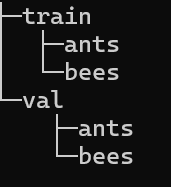
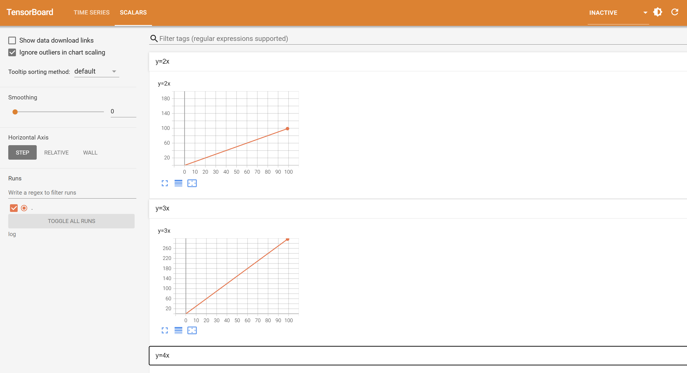
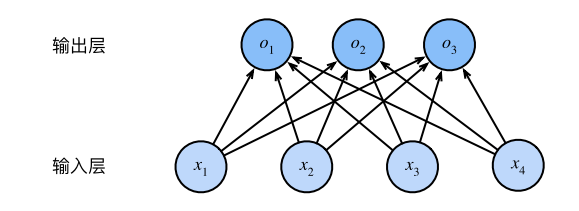
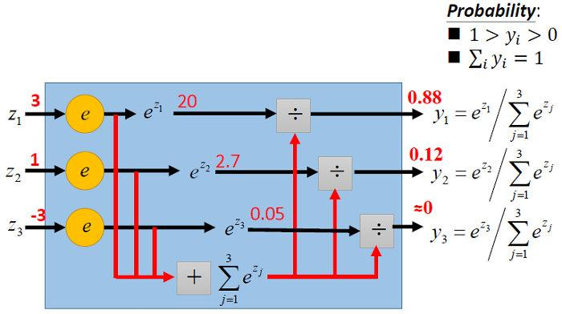

# Tensorflow

## 运算函数

| 函数          | 作用                                                       |
| ------------- | ---------------------------------------------------------- |
| tf.matmul     | 矩阵乘法                                                   |
| tf.square     | 求二次项                                                   |
| tf.reduce_sum | 张量求和，axis指定维度，keepdims输出形状是否与输入保持一致 |
|               |                                                            |
|               |                                                            |
|               |                                                            |
|               |                                                            |


## StringLookup

StringLookup将**字符串映射为整数**

```python
tf.keras.layers.StringLookup(
    max_tokens=None,
    num_oov_indices=1,
    mask_token=None,
    oov_token='[UNK]',
    vocabulary=None, # 初始化的字符串列表，不能重复
    idf_weights=None,
    invert=False,
    output_mode='int',# 输出模式，int表示输出整数，也可以是one_hot
    pad_to_max_tokens=False,
    sparse=False,
    encoding='utf-8',
    name=None,
    **kwargs
)
```


返回每个字符在vocabulary中的**索引位置+1**，对于不在vocabulary中的单词返回0

```python
vocab = ["a", "b", "c", "d"]
data = [["a", "c", "d"], ["d", "z", "b"]]
layer = StringLookup(vocabulary=vocab)
layer(data)
'''tf.Tensor(
[[1 3 4]
 [4 0 2]], shape=(2, 3), dtype=int64)
 '''
```

可以在后续以`adapt`的方式传入词表，**允许重复值**，但是多次调用会**覆盖**。**词表在内部按照出现次数降序排列，频次一样则按照字典序倒排**。

```python
data = [["a", "c", "d"], ["d", "z", "b"]]
layer = StringLookup()
layer.adapt(data)
layer.get_vocabulary()
'''
['[UNK]', np.str_('d'), np.str_('z'), np.str_('c'), np.str_('b'), np.str_('a')]

'''
```


## 初始化参数

```python
self.v=tf.Variable(
    initial_value=initializers.GlorotNormal()(shape=(num_features,num_factors)),
    trainable=True,
    dtype=tf.float32,
)
```


# Pytorch

## 下载地址

官网https://pytorch.org/get-started/locally/


安装win下的CUDA12.6命令 

> pip3 install torch torchvision --index-url https://download.pytorch.org/whl/cu126

## 张量

张量是pytorch中的数据表现形式，简单理解的话就是多维数组。


### 创建

张量的创建较为简单

```python
import torch
torch.zeros(4, 3, dtype=torch.long) # dtype指定数据类型
torch.rand(4, 3) # 随机数
torch.normal(0,0.01,size=(2,1),requires_grad=True)  # requires_grad用于跟踪梯度
```

其余常见的还有

|        函数         |                       功能                        |
| :-----------------: | :-----------------------------------------------: |
|    Tensor(sizes)    |                   基础构造函数                    |
|    tensor(data)     |                  类似于np.array                   |
|     ones(sizes)     |                        全1                        |
|    zeros(sizes)     |                        全0                        |
|     eye(sizes)      |                 对角为1，其余为0                  |
|  arange(s,e,step)   |                从s到e，步长为step                 |
| linspace(s,e,steps) |              从s到e，均匀分成step份               |
|  rand/randn(sizes)  | rand是[0,1)均匀分布；randn是服从N(0，1)的正态分布 |
|  normal(mean,std)   |         正态分布(均值为mean，标准差是std)         |
|     randperm(m)     |                     随机排列                      |


array类型可以转换到张量，但是这里会共享内存

```python
torch.from_numpy(ndarray) -> Tensor
```


### 数据类型

常见的数据类型如下


可以在创建数据时指定dtype，或者使用转换函数

```python
torch.zeros(10,2).double()
```

## 计算函数

| 函数      | 功能                                                         |
| --------- | ------------------------------------------------------------ |
| torch.sum | 求和，dim指定维度（0：列，1：行），keepdim指定输出的维度是否与输入保持一致 |
| torch.mm  | 矩阵乘法                                                     |
| torch.pow | 张量求幂                                                     |
|           |                                                              |
|           |                                                              |
|           |                                                              |
|           |                                                              |


## GPU加速计算

能使用GPU加速的部分有**模型，损失函数，加载的数据**   ，`torch.cuda.is_available()` 可以判断是否支持GPU运算


```python
device=torch.device('cpu' if not torch.cuda.is_available() else 'cuda')

# 模型和损失函数直接调用to(device)原地修改
model=myModel()
model.to(device)
loss_fn=nn.CrossEntropyLoss()
loss_fn.to(device)

# 数据部分需要先取出并赋值
for data in test_data_loader:
    imgs,labels=data
    imgs=imgs.to(device)
    labels=labels.to(device)
```

如果已经确定本地支持GPU，可以调用`.cuda()`

## reshap

`torch.reshape`用于改变图像维度，接受一个**张量和新形状的元组**

```python
b = torch.tensor([[0, 1], [2, 3]])
torch.reshape(b, (-1,2)) # 传入-1可以自动计算
```

## Flatten

nn.Flatten用于将**数据展平**，默认保留第一维

```python
fla=Flatten()
tmp=torch.ones((64,3,32,32))
fla(tmp).shape # torch.Size([64, 3072])
```


`nn.Flatten(start_dim=0)`指定`start_dim`参数，规定从哪一维开始展平


## DataSet

DataSet用于从给定的数据集中**按照索引取出数据以及返回数据集的大小**。对于不同结构的数据集有不同的定义方法，视需求而定。


对于该结构，可定义

```python
from torch.utils.data import Dataset
class Mydata(Dataset):
    def __init__(self,root_path,label_path):
        '''
        	初始化数据集的路径
        	root_path 到train文件夹下的路径
        	label_path 数据集的标签
        '''
        self.root_path=root_path
        self.label_path=label_path
        # 合并路径
        self.img_path=os.path.join(self.root_path,self.label_path)
        # 得到路径下所有文件名
        self.img_list=os.listdir(self.img_path)
    def __getitem__(self, idx):
        '''
        	按照索引取数据，返回的内容视情况而定
        '''
        img_name=self.img_list[idx]
        img_item_path=os.path.join(self.img_path,img_name)
        img=Image.open(img_item_path)
        label=self.label_path
        return img,label 
    def __len__(self):
        '''
        	返回数据集的长度
        '''
        return len(self.img_list)
```


取出数据

```python
img,_=ants[10]
img.show()
```


两个数据集可以**合并**，内容由组合顺序决定

```python
totalData=ants+bees
totalData[0][0].show()
```

## Tensorboard

Tensorboard是tensorflow中的可视化工具，安装命令 `pip install tensorboard`

```python
from torch.utils.tensorboard import SummaryWriter # 导入

writer=SummaryWriter('log') # 初始化，传入的参数是日志保存路径
...
writer.close() # 最后记得关闭
```


使用命令`tensorboard --logdir=log(指定的路径名)`打开页面观看结果




tensorboard用**标题名**区分图表，**相同的标题名会绘制到相同的图**，如果想清空图表则需要删除指定路径下的**日志文件**。


**add_scalar**是tensorboard中用于**绘制标量**的方法

```python
for i in range(100):
    writer.add_scalar('y=x',i,i) # 标题，y,x
```


**add_image**是tensorborad中用于**绘制图片**的方法，接受**张量或narray**，但是必须按照**[C,H,W]**排列

```python
writer.add_image('ants',img,global_step=1) # 标题，图片数据，指定global_step可以在一张图中拖动滑块观察变化
```


**add_graph**用于绘制**神经网络模型**，接受模型类和输入张量(可选)

```python
class myModel(nn.Module):
    def __init__(self):
        super().__init__()
        self.model=nn.Sequential(
            Conv2d(3,32,5,padding=2),
            MaxPool2d(2),
            Conv2d(32,32,5,padding=2),
            MaxPool2d(2),
            Conv2d(32,64,5,padding=2),
            MaxPool2d(2),
            Flatten(),
            Linear(1024,64) ,
            Linear(64,10)
        )
        
    def forward(self,x):
        return self.model(x)
    
    
writer.add_graph(model,tmp)
```


## Transforms

`torvision.transforms`用于**图像预处理和数据增强**。


`Totensor`是transforms中的一个类，用于将PIL image和ndarray类型转换为**张量**，并把像素值归一化到[0,1]

```python
from PIL import Image
from torchvision import transforms

img = Image.open("example.jpg") # PIL image类型
img2Tensor = transforms.ToTensor() # 注意，这是一个类，而非方法

img=img2Tensor(img) # 转换

print(tensor.shape)  # [C, H, W]
print(tensor.max(), tensor.min())  # 0.0 ~ 1.0
```


`Normalize`用于对图像张量进行**通道归一化处理**的类

```python
trans_norm=transforms.Normalize([0.5,0.5,0.5],[0.5,.5,0.5]) # 两个参数分别指定各个通道的均值和标准差
norm_img=trans_norm(img)
```


`Resize`是**调整图片尺寸（缩放）**的类，接受**PIL Image或张量格式**

```python
Resizer=transforms.Resize((400,300)) # 接受关于尺寸的元组
resize_img=Resizer(orginal_img)
resize_img.show()
```


`RandomCrop`是用于**从图片中随即裁剪**的类，接受**PIL Image或张量格式**

```python
# 自动填充至足够尺寸后裁剪
crop = transforms.RandomCrop(
    size=(224, 224),     # 指定尺寸
    pad_if_needed=True,  # 原图尺寸不足时自动填充
    padding_mode="edge"  # 用边缘像素填充
)
```


**`Compose`**是用于定义**流水线处理**的类，其参数为上述介绍的各个类

```python
trans_compose=transforms.Compose([transforms.Resize((400,300)),transforms.ToTensor(),transforms.Normalize([0.5,.5,.5],[.5,.5,.5])]) # 集成多种功能

img_compose=trans_compose(bees[101][0]) # 处理

writer.add_image('compose image',img_compose)
```

## torvision中的数据集

**torvision**中提供了一些便利的**数据集**，通过`datasets`加载，返回的结果是**DataSet**类型

```python
from torchvision import datasets
# root 数据集根路径（不是具体路径），train 训练集 or 测试集，download 是否下载数据集，transform transforms.Compose对象
train=datasets.CIFAR10(root='./datasets',transform=transforms.ToTensor(),train=True)
test=datasets.CIFAR10(root='./datasets',transform=transforms.ToTensor(),train=True)
```

## Dataloader

Dataloader用于**从DataSet中取数据**。

```python
from torch.utils.data import DataLoader
# dataset 数据集datastes类型；batch_size一批次取多少图片；shuffle是否打乱；drop_last最后一批不足时，是否丢弃
train_loader=DataLoader(dataset=train,batch_size=32,shuffle=True,drop_last=True)

# 绘图
from torch.utils.tensorboard import SummaryWriter
writer=SummaryWriter('log')
step=0

# 每轮迭代会从DadaLoader中取出batch_size个数据，数据会按照数据集的格式打包
for data in train_loader:
    imgs,labels=data# 拆分
    writer.add_images('DataLoader_32',imgs,step)
    step+=1
writer.close()
```

## nn.Module

`nn.Module`是一个类，作为所有神经网络的模型的父类，每个神经网络模型都要重写`init和forward`函数


```python
import torch.nn as nn
import torch.nn.functional as F

class myNN(nn.Module):
    def __init__(self):
        super().__init__()
    def forward(self,x):
        return x+1	  
```


## nn.Conv2d

nn.Conv2d是用于**二维卷积**的类


`nn.Conv2d(in_channels, out_channels, kernel_size, stride=1, padding=0, dilation=1, groups=1, bias=True, padding_mode='zeros', device=None, dtype=None*)`

+ in_channels 输入的通道数
+ out_channels 输出的通道数
+ kernel_size 卷积核的大小，`int` 或 `(int, int)` 正方形或不规则形
+ padding 往外填充多少层，`int` 或 `(int, int) 横向纵向填充量的不同`
+ dilation 卷积核之间的间隔，
+ bias 是否设置偏置项

```python
from torch.nn import Conv2d

class myNetwork(nn.Module):
    def __init__(self):
        super().__init__()
        self.conv1=Conv2d(3,6,3)
    def forward(self,x):
        return self.conv1(x)
```


下图是计算尺寸的公式


一般的算法结构图是不会给出**stride和padding**的大小，需要自行计算。

## nn.MaxPool2d

nn.MaxPool2d处理二维的最大池化层


`nn.MaxPool2d(kernel_size, stride=None, padding=0, dilation=1, return_indices=False, ceil_mode=False)`，最主要的参数**kernel_size**决定卷积核大小

## nn.Sequential

nn.Sequential用于**组合网络中多个层，同时调用**。

```python
class myModel(nn.Module):
    def __init__(self):
        super().__init__()
        self.conv1=Conv2d(3,32,5,padding=2)
        self.maxPool1=MaxPool2d(2)
        self.conv2=Conv2d(32,32,5,padding=2)
        self.maxPool2=MaxPool2d(2)
        self.conv3=Conv2d(32,64,5,padding=2)
        self.maxPool3=MaxPool2d(2)
        self.flatten=Flatten()
        self.linear1=Linear(1024,64) 
        self.linear2=Linear(64,10)
    def forward(self,x):
        x=self.conv1(x)
        x=self.maxPool1(x)
        x=self.conv2(x)
        x=self.maxPool2(x)
        x=self.conv3(x)
        x=self.maxPool3(x)
        x=self.flatten(x)
        x=self.linear1(x)
        x=self.linear2(x)
        return x

# 使用Sequential更方便
class myModel(nn.Module):
    def __init__(self):
        super().__init__()
        self.model=nn.Sequential(
            Conv2d(3,32,5,padding=2),
            MaxPool2d(2),
            Conv2d(32,32,5,padding=2),
            MaxPool2d(2),
            Conv2d(32,64,5,padding=2),
            MaxPool2d(2),
            Flatten(),
            Linear(1024,64) ,
            Linear(64,10)
        )
        
    def forward(self,x):
        return self.model(x)
```


## 损失函数

损失函数用于**计算张量之间**的差，张量的数据类型必须是**浮点数**

```python
import torch.nn as nn

inputs=torch.tensor([1,2,3],dtype=float)
targets=torch.tensor([3,2,1],dtype=float)

loss=nn.L1Loss()
loss(inputs,targets)
```

## backward

backward会沿着计算链一路求解**张量的梯度**。

```python
loss=nn.CrossEntropyLoss()
for data in loader:
    imgs,labels=data
    out=model(imgs)    
    res_loss=loss(out,labels)
    res_loss.backward()
```


## 优化器

优化器存放在`torch.optim`，需要传入**模型的参数，学习率**，以及其他一些优化器所需的设置

```python
loader=DataLoader(datas,batch_size=32)
loss=nn.CrossEntropyLoss()
# 优化器
optimizer=optim.SGD(model.parameters(),lr=0.01)

for epoch in range(20):
    run_loss=0
    for data in loader:
        # 每轮开始清空梯度
        optimizer.zero_grad()
        imgs,labels=data
        out=model(imgs)    
        res_loss=loss(out,labels)
        res_loss.backward()
        # 更新网络参数
        optimizer.step()
        run_loss+=res_loss
    print(run_loss)
```

## 现有的网络结构及修改

模型的导入非常简单

```python
vgg16=torchvision.models.vgg16(pretrained=True)
```

可以对现有的模型做修改，加载得到的vgg16模型的结构是

> VGG(
>   (features): Sequential(
>     (0): Conv2d(3, 64, kernel_size=(3, 3), stride=(1, 1), padding=(1, 1))
>     (1): ReLU(inplace=True)
>     (2): Conv2d(64, 64, kernel_size=(3, 3), stride=(1, 1), padding=(1, 1)).....
>   )
>   (avgpool): AdaptiveAvgPool2d(output_size=(7, 7))
>   (classifier): Sequential(
>     (0): Linear(in_features=25088, out_features=4096, bias=True)
>     (1): ReLU(inplace=True)
>     (2): Dropout(p=0.5, inplace=False)
>     (3): Linear(in_features=4096, out_features=4096, bias=True)
>     (4): ReLU(inplace=True)
>     (5): Dropout(p=0.5, inplace=False)
>     (6): Linear(in_features=4096, out_features=1000, bias=True)
>   )
> )


`add_module`函数会在网络结构外添加**一个分区和层级**

```python
vgg16.add_module('extra',torch.nn.Linear(1000,10))
```

> .....
>
>  (classifier): Sequential(
>     (0): Linear(in_features=25088, out_features=4096, bias=True)
>     (1): ReLU(inplace=True)
>     (2): Dropout(p=0.5, inplace=False)
>     (3): Linear(in_features=4096, out_features=4096, bias=True)
>     (4): ReLU(inplace=True)
>     (5): Dropout(p=0.5, inplace=False)
>     (6): Linear(in_features=4096, out_features=1000, bias=True)
>   )
>   **(extra): Linear(in_features=1000, out_features=10, bias=True)**
> )


可以指定具体修改那个分区，以及其中的某个结构

```python
vgg16.classifier[-1]=torch.nn.Linear(4096,10)
```

> ....
>
>   (classifier): Sequential(
>     (0): Linear(in_features=25088, out_features=4096, bias=True)
>     (1): ReLU(inplace=True)
>     (2): Dropout(p=0.5, inplace=False)
>     (3): Linear(in_features=4096, out_features=4096, bias=True)
>     (4): ReLU(inplace=True)
>     (5): Dropout(p=0.5, inplace=False)
>     ****(6): Linear(in_features=4096, out_features=10, bias=True)**
>   )**
>
> ....


## 模型的保存和加载

pytorch中模型的加载和保存有两种方式：**保存整个模型，仅保存参数**

```python
class myModel...

torch.save(model, "model_full.pth")
model = torch.load("model_full.pth")
```

```python
torch.save(model.state_dict(), "model.pth")

model = MyModel()           # 模型初始化
model.load_state_dict(torch.load("model.pth"))
```

**第一种方式需要定义了模型的类，第二种方式需要模型已经初始化**


在**gpu**上训练的参数加载到**cpu**上需要说明映射关系——`torch.load('XX',map_location=torch.device('cpu'))`


## 模型的基本训练步骤

`model.train()`和`model.eval()`用于**切换模型中某些特殊层的行为**，例如**Dropout** ，训练时会随即丢弃，验证时关闭丢弃功能，所有神经元参与运算；以及**Batch Normalization**。如果模型中不存在这些特殊层，那么不需要添加

```python
# 导入相关包
import torch
import torchvision
from torch.utils.data import Dataset,DataLoader
import torch.nn as nn
from torch.utils.tensorboard import SummaryWriter
from torchvision import transforms

# 检查设备
device=torch.device('cpu' if not torch.cuda.is_available() else 'cuda')

# 加载训练和测试数据集
train_data=torchvision.datasets.CIFAR10(root='./datasets',train=True,download=True,transform=transforms.ToTensor())
test_data=torchvision.datasets.CIFAR10(root='./datasets',train=False,download=True,transform=transforms.ToTensor())

#定义模型
class myModel(nn.Module):
    def __init__(self):
        super().__init__()
        self.model=nn.Sequential(
        nn.Conv2d(3,32,5,padding=2),
        nn.MaxPool2d(2),
        nn.Conv2d(32,32,5,padding=2),
        nn.MaxPool2d(2),
        nn.Conv2d(32,64,5,padding=2),
        nn.MaxPool2d(2),
        nn.Flatten(),
        nn.Linear(1024,64),
        nn.Linear(64,10))
    def forward(self,x):
        return self.model(x)

# 数据加载器
train_data_loader=DataLoader(train_data,batch_size=64,shuffle=True)
test_data_loader=DataLoader(test_data,batch_size=64,shuffle=True)

# 加载模型
model=myModel()
model.to(device)

# 加载损失函数
loss_fn=nn.CrossEntropyLoss()
loss_fn.to(device)

epoch=10 #  迭代次数
optimizer=torch.optim.SGD(model.parameters(),lr=learning_rate) # 优化器

# 记录训练次数
total_train_times=0
total_test_times=0
# 可视化
writer=SummaryWriter('log8')

# 迭代多次
for i in range(1,epoch+1):
    print(f'-------------epoch:{i} begining---------------')
    # 取数据训练
    # model.train()
    for data in train_data_loader:
        # 加载数据
        imgs,labels=data
        imgs=imgs.to(device)
        labels=labels.to(device)
        
        # 计算损失
        outputs=model(imgs)
        loss=loss_fn(outputs,labels)
        
        # 反向传递并更新参数
        optimizer.zero_grad()
        loss.backward()
        optimizer.step()
        total_train_times+=1
        
        if total_train_times%100==0:
            print('total_train_times:',total_train_times,'total_loss:',loss)
    
    # 用测试集计算误差，检查模型是否正确工作
    # model.eval()
    total_loss=0
    with torch.no_grad(): # 测试阶段不要计算梯度
        for data in test_data_loader:
            imgs,labels=data
            outputs=model(imgs)
            loss=loss_fn(outputs,labels)
            total_loss+=loss
            
    total_test_times+=1
    print('total_loss:',total_loss)
    
    # 绘图
    writer.add_scalar('test_loss',total_loss,total_train_times)
```


## 模型验证

使用**torch.no_grad**节省资源，所有的张量操作不会追踪计算图，不会计算梯度。

```python
model.eval()
with torch.no_grad():
    ...
```

## 初始化参数

初始化参数的方法有三种，一是自定义函数

```python
net=nn.Sequential(nn.Flatten(),nn.Linear(28*28,10))
# 函数
def init_weights(m):
    if type(m)==nn.Linear: # 修改线性层
        nn.init.normal_(m.weight,std=0.01) # 正态分布
        nn.init.constant_(m.bias, 0) # 固定值
# 应用
net.apply(init_weights)
```


二是对层单独操作

```python
net=nn.Sequential(nn.Linear(2,1))
net[0].weight.data.normal_(0,0.)
net[0].bias.data.fill_(0)
```


三是在网络结构中定义

```python
class FM(nn.Module):
    def __init__(self,num_features,num_factors):
        super(FM, self).__init__()
        self.linear=nn.Linear(num_features,1)
        self.v=nn.Parameter(torch.randn(num_features,num_factors))
```


# 线性神经网络

## 线性回归

### 原理

线性回归基于几个简单的假设：首先，假设自变量x和因变量y之间的关系是线性的，这里通常允许包含观测值的一些噪声；其次，假设噪声都遵循正态分布。

公式表示为


$$
\hat{y} = w_1 x_1 + \dots + w_d x_d + b
$$


用点积形式简介表达模型
$$
\hat{y} = \mathbf{w}^\top \mathbf{x} + b
$$


单个样本的损失函数为平方误差函数
$$
l^{(i)}(\mathbf{w}, b) = \frac{1}{2} \left( \hat{y}^{(i)} - y^{(i)} \right)^2
$$


为了度量模型在整个数据集上的质量，需要计算在训练集n个样本的上的损失均值
$$
 L(\mathbf{w}, b) = \frac{1}{n} \sum_{i=1}^{n} l^{(i)}(\mathbf{w}, b) = \frac{1}{n} \sum_{i=1}^{n} \frac{1}{2} \left( \mathbf{w}^\top \mathbf{x}^{(i)} + b - y^{(i)} \right)^2
$$
随后小批量随机梯度下降


$$
\mathbf{w} \leftarrow \mathbf{w} - \frac{\eta}{|\mathcal{B}|} \sum_{i \in \mathcal{B}} \partial_{\mathbf{w}} l^{(i)}(\mathbf{w}, b) = \mathbf{w} - \frac{\eta}{|\mathcal{B}|} \sum_{i \in \mathcal{B}} \mathbf{x}^{(i)} \left( \mathbf{w}^\top \mathbf{x}^{(i)} + b - y^{(i)} \right) \\
 b \leftarrow b - \frac{\eta}{|\mathcal{B}|} \sum_{i \in \mathcal{B}} \partial_b l^{(i)}(\mathbf{w}, b) = b - \frac{\eta}{|\mathcal{B}|} \sum_{i \in \mathcal{B}} \left( \mathbf{w}^\top \mathbf{x}^{(i)} + b - y^{(i)} \right)
$$


其中$\mathcal{B}$是批量大小，$\eta$是学习率


### 手动实现

```python
import torch
import random
```


```python
'''
根据带有噪声的线性模型构造一个人造数据集
'''
def synthetic_data(w,b,num_example):
    X=torch.normal(0,1,(num_example,len(w)))
    y=torch.matmul(X,w)+b
    y+=torch.normal(0,0.01,y.shape)
    return X,y.reshape((-1,1))
```


```python
true_w=torch.tensor([2,-3.4])
true_b=4.2
features,labels=synthetic_data(true_w,true_b,1000)
```


```python
'''
读取数据集，每次抽取一小批量样本
'''
def data_iter(batch_size,features,labels):
    num_examples=len(features)
    indices=list(range(num_examples)) # 生成索引
    random.shuffle(indices) # 随机打乱
    for i in range(0,num_examples,batch_size):
        batch_indices=torch.tensor(indices[i:min(i+batch_size,num_examples)])
        yield features[batch_indices],labels[batch_indices] # yield关键字定义生成器函数，，允许一次返回一个结果，而不是一次性返回所有的结果
```


```python
# 初始化参数
w=torch.normal(0,0.01,size=(2,1),requires_grad=True)
b=torch.zeros(1,requires_grad=True)
```


```python
'''
    定义模型
'''
def linreg(X,w,b):
    return torch.matmul(X,w)+b
```


```python
'''
    定义损失函数
'''
def squared_loss(y_hat,y):
    return (y_hat-y.reshape(y_hat.shape))**2/2
```


```python
'''
    定义优化算法
'''
def sgd(params,lr,batch_size):
    with torch.no_grad(): # 禁止梯度计算，防止更新过程中发生梯度计算
        for param in params:
            param-=lr*param.grad/batch_size # 更新参数
            param.grad.zero_() # 清空参数的梯度

```


```python
# 准备
lr=0.03
num_epochs=3
net=linreg
loss=squared_loss
batch_size=10
```


```python
# 训练
for epoch in range(num_epochs):
    for X,y in data_iter(batch_size,features,labels):
        l=loss(net(X,w,b),y)
        l.sum().backward() # 反向传播
        sgd([w,b],lr,batch_size)
    # 用更新的参数计算下损失，用于可视化
    with torch.no_grad():
        tran_l=loss(net(features,w,b),labels)
        print(f'epoch {epoch+1}, loss {float(tran_l.mean()):.4f}')

```

    epoch 1, loss 0.0412
    epoch 2, loss 0.0002
    epoch 3, loss 0.0001


```python
print(f'w的估计误差: {true_w-w.reshape(true_w.shape)}')
print(f'b的估计误差: {true_b-b}')
```

    w的估计误差: tensor([ 0.0004, -0.0002], grad_fn=<SubBackward0>)
    b的估计误差: tensor([4.1962e-05], grad_fn=<RsubBackward1>)

### 简洁实现

```python
import numpy as np
import torch
from torch.utils.data import Dataset, DataLoader,TensorDataset
from d2l import torch as d2l
```


```python
'''
生成数据
'''
def synthetic_data(w,b,num_example):
    X=torch.normal(0,1,(num_example,len(w)))
    y=torch.matmul(X,w)+b
    y+=torch.normal(0,0.01,y.shape)
    return X,y.reshape((-1,1))
true_w = torch.tensor([2, -3.4])
true_b = 4.2
features, labels = d2l.synthetic_data(true_w, true_b, 1000)
```


```python
'''
用迭代器封装随机生成的数据
'''
def load_array(data_arrays,batch_size,is_train=True):
    dataset=TensorDataset(*data_arrays) # TensorDataset接受特征和标签并封装为Dataset
    return DataLoader(dataset,batch_size=batch_size,shuffle=is_train)
```


```python
batch_size=10
data_iter=load_array((features,labels),batch_size)
```


```python
# 观察是否正常工作
next(iter(data_iter))
```


    [tensor([[-0.4564, -0.8860],
             [-0.3930,  1.4651],
             [ 0.9992,  1.0779],
             [-0.5995, -1.1271],
             [ 0.7299, -0.5281],
             [ 0.9507,  1.7498],
             [ 0.5979, -1.5631],
             [ 0.5104,  1.9488],
             [-0.6493,  1.0971],
             [-1.2549,  0.1513]]),
     tensor([[ 6.3150],
             [-1.5595],
             [ 2.5221],
             [ 6.8380],
             [ 7.4642],
             [ 0.1455],
             [10.7019],
             [-1.4121],
             [-0.8180],
             [ 1.1631]])]


```python
from torch import nn
# 定义网络
net=nn.Sequential(nn.Linear(2,1))
```


```python
# 初始化网络参数
net[0].weight.data.normal_(0,0.01)
net[0].bias.data.fill_(0)
```


    tensor([0.])


```python
# 损失函数
loss=nn.MSELoss()
```


```python
# 优化器
trainer=torch.optim.SGD(net.parameters(),lr=0.01)
```


```python
num_epoch=3
for epoch in range(num_epoch):
    for X,y in data_iter:
        l=loss(net(X),y)
        # 优化器每轮清空参数
        trainer.zero_grad()
        l.backward()
        trainer.step()
    with torch.no_grad():
        l=loss(net(features),labels)
        print(f'epoch {epoch+1}, loss {l:f}')
```

    epoch 1, loss 0.660061
    epoch 2, loss 0.014986
    epoch 3, loss 0.000470


```python
w = net[0].weight.data
print('w的估计误差：', true_w - w.reshape(true_w.shape))
b = net[0].bias.data
print('b的估计误差：', true_b - b)
```

    w的估计误差： tensor([ 0.0070, -0.0172])
    b的估计误差： tensor([0.0082])


## Softmax回归

softmax回归是逻辑回归的一般形式，用于多分类。




对于输入数据$\{(x_1,y_1),(x_2,y_2),\dots,(x_m,y_m)\}$有$k$个类别，即$y_i \in \{1,2,\dots,k\}$，那么softmax回归主要估算输入数据$x_i$归属于每一类的概率，即 $$h_\theta(x_i) = \begin{bmatrix} p\left(y_i=1|x_i;\theta\right) \\ p\left(y_i=2|x_i;\theta\right) \\ \vdots \\ p\left(y_i=k|x_i;\theta\right) \end{bmatrix} = \frac{1}{\sum_{j=1}^k e^{\theta_j^T x_i}} \begin{bmatrix} e^{\theta_1^T x_i} \\ e^{\theta_2^T x_i} \\ \vdots \\ e^{\theta_k^T x_i} \end{bmatrix} \tag{1}$$ 其中，$\theta_1,\theta_2,\dots,\theta_k \in \theta$是模型的参数，乘以$\frac{1}{\sum_{j=1}^k e^{\theta_j^T x_i}}$是为了让概率位于$[0,1]$并且概率之和为1，softmax回归将输入数据$x_i$归属于类别$j$的概率为 $$p\left(y_i=j|x_i;\theta\right) = \frac{e^{\theta_j^T x_i}}{\sum_{l=1}^k e^{\theta_l^T x_i}} \tag{2}$$





损失函数如下，$\hat{y}$为模型预测，y为真实值

$$
\begin{align*}
l(\mathbf{y}, \hat{\mathbf{y}}) = -\sum_{j=1}^{q} y_j \log \hat{y}_j
&= -\sum_{j=1}^{q} y_j \log \frac{\exp(o_j)}{\sum_{k=1}^{q} \exp(o_k)} \\
&= \sum_{j=1}^{q} y_j \log \sum_{k=1}^{q} \exp(o_k) - \sum_{j=1}^{q} y_j o_j \\
&= \log \sum_{k=1}^{q} \exp(o_k) - \sum_{j=1}^{q} y_j o_j.
\end{align*}
$$


# 卷积神经网络

当使用全连接神经网络处理大尺寸图象时，有三个明显的特点：

1. 将图像展开为向量会丢失空间信息
2. 参数过多效率低下，训练困难
3. 大量的参数会导致网络过拟合

假设我们有一个足够充分的照片数据集，数据集中是拥有标注的照片，每张照片具有百万级像素，这意味着网络的每次输入都有一百万个维度。即使将隐藏层维度降低到1000，这个全连接层也将有$10^6×10^3$=$10^9$个参数。


卷积神经网络由三部分组成：

1. 卷积层：提取图像特征
2. 池化层(下采样)：降维，防止过拟合，降低卷积层对边缘的敏感性。
3. 全连接层：计算并输出

卷积神经网络各层中的神经元是三维排列的：宽度，高度和深度


- 感受野：网络中某一层的某一个神经元在输入图像上所看到的区域大小	
- 权值共享：卷积运算中采用权值共享可以有效减少需要求解的参数
- 分辨率指的是输入模型的图像尺寸(长宽)


卷积表达的是互相关运算，它通过在输入图像上滑动不同的卷积核并执行一定的运算产生一组平行的特征图。一张特征图中的元素都是通过一个卷积核计算得出的，即一张特征图共享了相同的权重和偏置项


将窗口对应的位置与核函数对应相乘，然后求和取得输出。这种方式会丢失边缘特征，因此通过padding扩充原图像(补0)，然后再提取特征。

具体应用中往往会有多个卷积核，每个卷积核代表了一种图像模式


池化层的操作主要有**最大池化**和**平均池化**

如下所示的是对20*20的卷积层用10\*10的窗口进行池化操作


经过卷积层和池化层处理过的数据塞给全连接层


典型的CNN并非只有三层结构，而是多层结构，以LeNet-5为例

卷积层-池化层-卷积层-池化层-卷积层-全连接层


